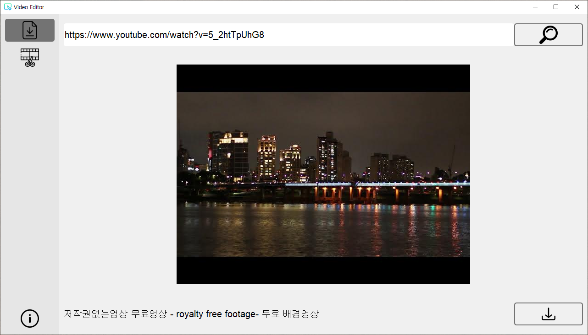
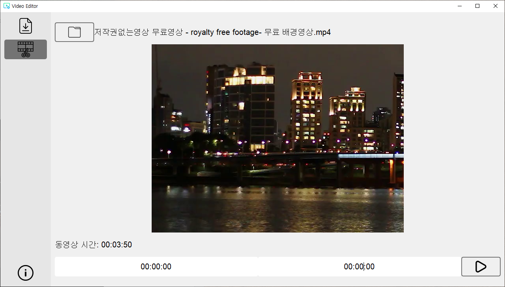

# Video Edit Download

***
## 환경
- windows10
- python 3.9.13
- ffmpeg

***
## python
- numpy==1.23.4
- opencv-python==4.6.0.66
- PySide6==6.4.0.1
- PySide6-Addons==6.4.0.1
- PySide6-Essentials==6.4.0.1
- pytube==12.1.0
- shiboken6==6.4.0.1
- wincertstore==0.2

***
## 기본 세팅
pip install pyside6 opencv-python

1. ffmpeg 공식 홈페이지에서 build 된 essentials 파일을 받아 ffmpeg 폴더로 압축을 풀어준다.

***
## 사용 가이드

1. 상단 왼쪽 유트브 링크를 입력한다.
2. 상단 오른쪽 버튼을 눌러 검색을 한다.
3. 중간에 썸네일이 나올 경우 하단 왼쪽에 제목이 맞는지 확인 한다.
    - 3-1. 중간에 이미지가 않나오고 하단 왼쪽에 '동영상 주소 검색에 실패하였습니다.'가 나올경우 1번에 링크를 다시 작성한다.
4. 하단 오른쪽 버튼을 눌러 다운로드를 진행한다.

1. 상단 왼쪽 버튼을 눌러 자를 동영상을 찾는다.
2. 상단 오른쪽 동영상 이름 및 중간에 동영상 이미지 및 동영상의 길이 정보를 확인한다.
3. 하단 왼쪽에 시작 시간 및 끝나는 시간을 작성한다.
   - 3-1. 양식은 '시간 : 분 : 초' 로 입력하는데 중간에 `:`가 있어야 하며 공백이 없어야한다.
4. 하단 오른쪽에 실행 버튼을 누르면 동영상이 잘라진다. 위치는 편집하는 동영상 위치에 생성이된다. [이름에 `cut`이 마지막에 추가되어 생성]

***
## 파일 exe
pyinstaller --clean -w --icon=logo.ico -F -n 위클리 main.py